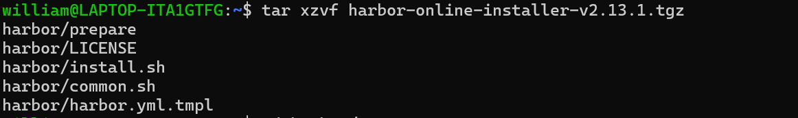

# DevOps
Page for DevOps

## Harbor Container Registry
- Make sure docker and OpenSSL is installed
- Download Harbor installer: `$ wget https://github.com/goharbor/harbor/releases/download/v2.13.1/harbor-online-installer-v2`

- Extract: `$ tar xzvf harbor-online-installer-v2.13.1.tgz` 
- Change directory to harbor folder: `$ cd harbor` 
- Duplicate and rename to harbor.yml and edit the content: `$ cp harbor.yml.tmpl harbor.yml` followed by
`$ vim harbor.yml` 
 

- Install: `$ sudo ./install.sh` 
- Access http://localhost:8088/ using user: `admin`, password: `<the passyourd you configured in harbor.yml>`

- Reference: https://goharbor.io/docs/2.13.0/install-config/download-installer/
  
