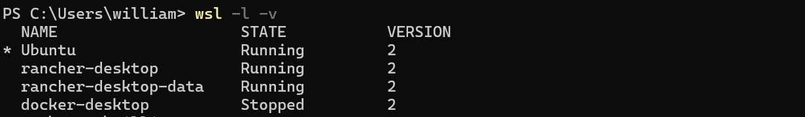
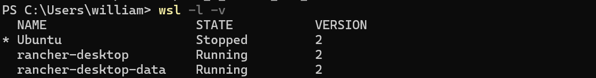
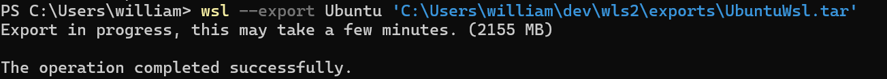
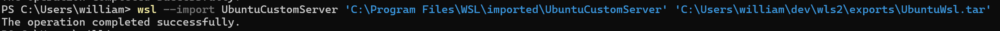
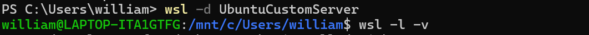

# WSL2 on Windows

## Check running servers
`wsl -l -v`

## Export distro
- `wsl --terminate <DistributionName> <Filename>`
  - `wsl --terminate Ubuntu`
     
     
- `wsl --export <DistributionName> <Filename>`
  - `wsl --export Ubuntu C:\Users\william\dev\wls2\exports\UbuntuWsl.tar`
     
  - 
## Import distro
- `wsl –import <Image Name you choose> <Directory to store and run the image> 
    <Directory location of the exported .tar file>`
   - `wsl --import UbuntuCustomServer 'C:\Program Files\WSL\imported\UbuntuCustomServer' 'C:\Users\william\dev\wls2\exports\UbuntuWsl.tar'`
  

## Run distro
- `wsl -d <ImageName>`
  - `wsl -d UbuntuCustomServer`. Notice on the terminal that it will switch to WSL directory. It means that the image successfully run. 
  